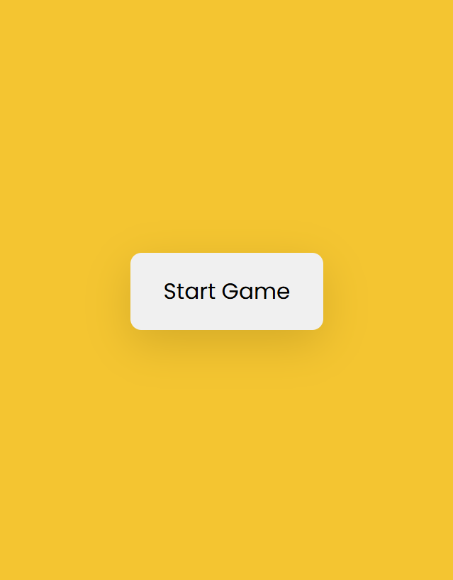
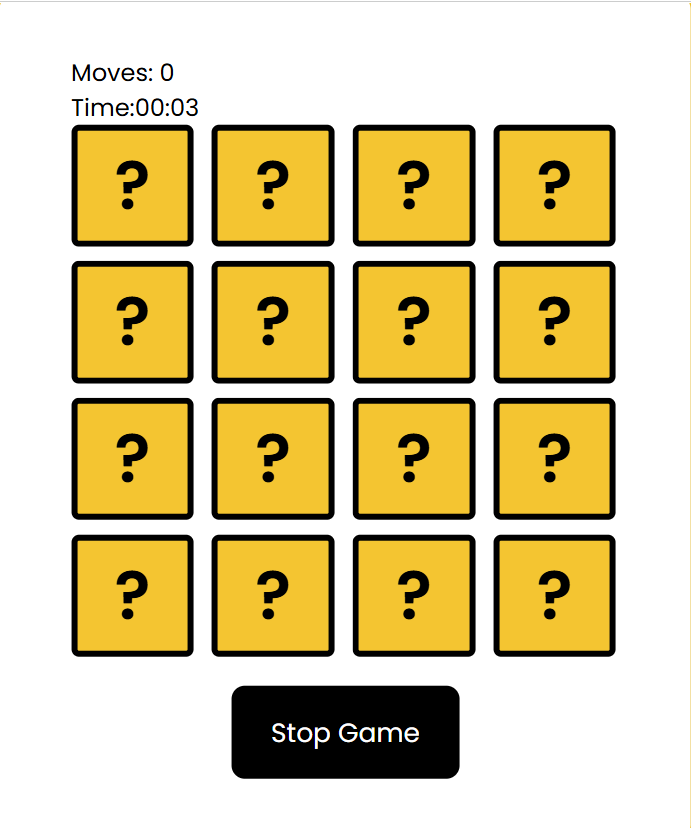
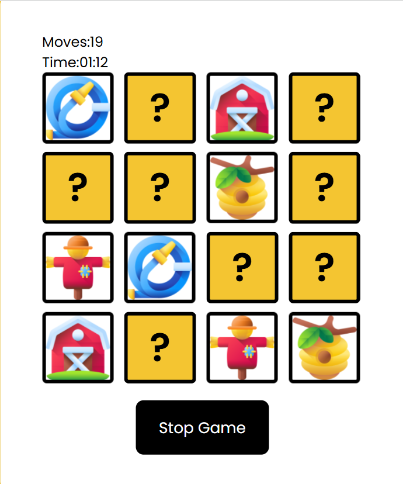
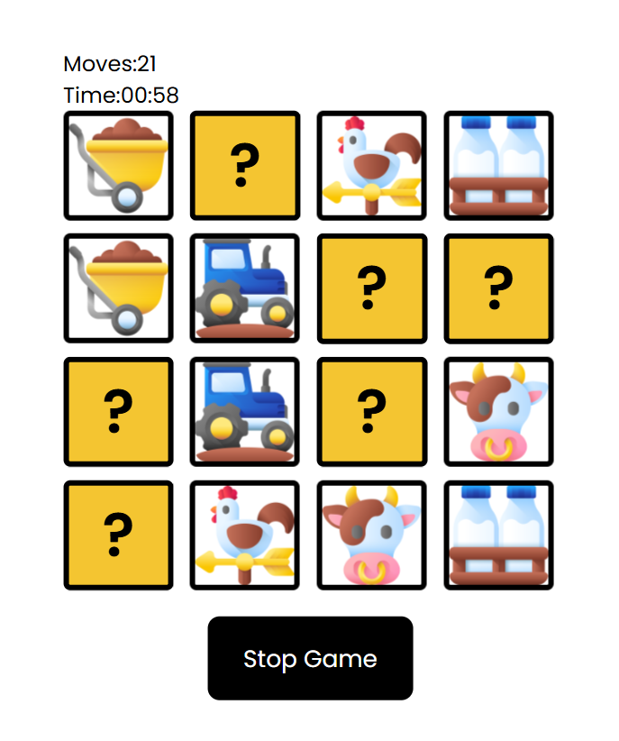
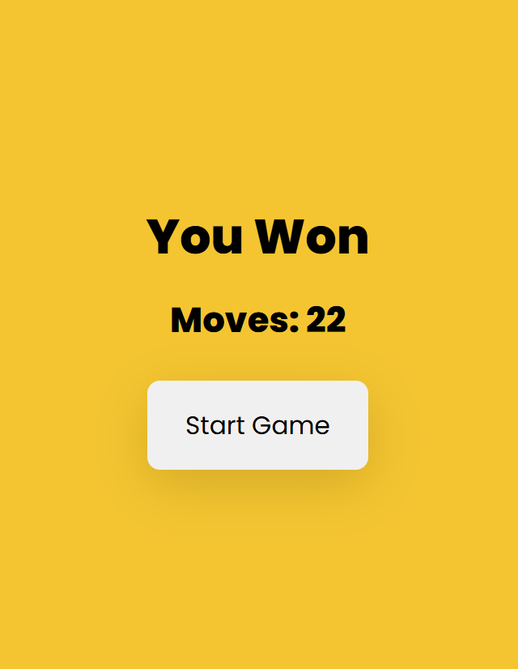

# 🌾 Farm Memory Game – JavaScript Interactive Project
A fun and interactive Memory Matching Game built with **JavaScript**, **HTML**, and **CSS**, featuring a farm-themed set of icons.
This improved version includes a timer, move counter, **Fisher–Yates shuffle algorithm**, dynamic grid generation, and smooth card-flip animations.

Ideal for practicing JavaScript logic, DOM manipulation, event handling, and data-driven UI generation.

---

## 🧩 Game Logic Summary
The game flow:
1. Start game → timer + counters reset.
2. Generate random card list.
3. Duplicate cards → shuffle → render grid.
4. User flips card → save first/second card.
5. Compare:
    Match → lock cards
    Not match → flip back after delay
6. Track moves + win progress.
7. When all matches found → show result.

---

## 🌟 Features

✔️ Farm Items Dataset
The game uses a dynamic object array with 18 unique farm-themed icons (farmer, pumpkin, tractor, cow, seeds, sunflower, etc.).

✔️ Smart Random Card Generation
- Generates a 4×4 grid (16 cards).
- Randomly selects 8 unique items from the list.
- Duplicates them to create pairs.
- Uses the Fisher–Yates algorithm for true random shuffling.

✔️ Gameplay Mechanics
- Flip animation for each card.
- Matching logic based on custom data-card-value attributes.
- Unmatched cards flip back after a 900ms delay.
- Matched cards are locked using a .matched class.
- Game ends when all pairs are found.

✔️ Scoring & UX
- Timer (mm:ss format)
- Moves counter
- Win result message
- Start / Stop game controls
- Clean reset using an initializer function

✔️ Clean & Organized Code
- ES6+ arrow functions
- DOM manipulation
- Separation of logic (generate random cards, shuffle, create matrix, timer, counter…)
- Readable structure with comments

---

## 🐄 Game Preview 🎮

---

## 🚀 How to Run the Game
1. Clone the repository
   git clone https://github.com/Karlenypc/Memory-Game.git
2. Open the project folder
3. Run the project
   Simply open the index.html in any browser:
    - Double click index.html OR Use Live Server in VS Code for best experience.

---

## 🔧 Future Improvements
- Difficulty levels (4×4, 6×6, 8×8)
- Sound effects
- Scoreboard with best times
- Animated win screen
- Responsive mobile view improvements
- Adding a loss condition after reaching a certain number of moves

---

## 💬 Author
Karleny Pérez

---
## 📜 License
This project is open-source and free to use.
